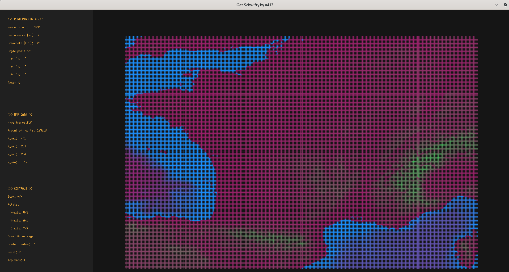

# FdF

This project is about representing a map/landscape as a 3D object in which all surfaces are outlined in lines using “iron wire” meshing (therefore the name 'fil de fer' = iron wire).

https://user-images.githubusercontent.com/66411482/222748303-cccb3f8d-b2f4-4948-a9fb-d4a9a43c2b1d.mp4

### Rendered map


## Project Overview

The goal of this project is to familiarise with
* input handling
* 3D rendering
* colour representation with the RGB hexcolour scheme
* user input processing 
* representation as well as manipulation of 3D objects in space using linear algebra as tools in the background

The input data is delivered as a text file with distinct data points containing information on their position in the xy-plane, the z-value and optionally a given hexcolour.

The 3D rendering is accomplished with the minilibX library developed by 42CodingSchool based on X Server interfacing via Xlib.

Colours are handled according to the RGB colour model in hexadecimal representation, e.g. 0xF3AF3D (= saffron). The colouring in this project assigns distinct predefined values to the min/max points in the map and thereafter calculates the gradient colour for each respective point within the min/max band.

User input is mostly handled in the bonus program allowing the user to
* zoom in/out
* rotate the map around the x/y/z-axis
* change the z-value (=height) of the data points
* move the map
* change the perspective (standard is isometric)

The rotations and translations are implemented via matrix multiplications (rf. rotational matrices) and vector additions.

The line drawing algorithm used is Bresenhams algorithm. 

## Installation

```
git clone git@github.com:u413-284-si/FdF.git fdf
cd fdf
make
./fdf ./maps/<choose a map>
```

For bonus program (while within the fdf directory):

```
make bonus
./super_fdf ./maps/<choose a map>
```

Enjoy!

## Showcase

### La douce France



### La douce France plus proche


### 最高の人生


### Julia set


### More fractal


## Contact & contribute
To contact me and for feedback in order to fix bugs/improve the project you may write me a message to **sqiu@student.42vienna.com**.
